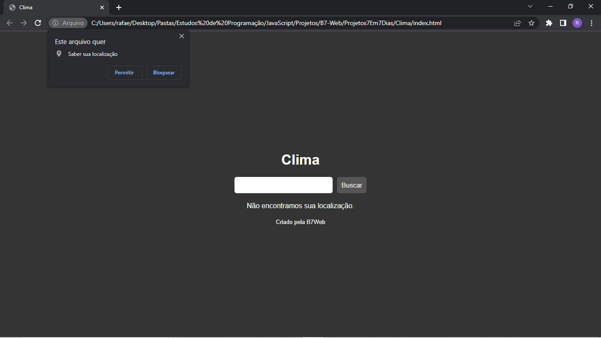

<h2 align="center"> 
  
</h2>

---
## Sobre
**Projeto Clima** Esse projeto mostra os climas da cidades que for pesquisadas no campo de busca. As informações mostradas são, temperatura, vento, a direção do vento e um icon para mostrar a contições do tempo, como nublado, sol...
 
Quando o usuário acessar o site, o site vai pedi um permisão para acessar a localização do usuário para mostrar as informação da cidade que ele se encontra.

----
  #### GitHub Pages: https://aurelianoderafa.github.io/ProjectClimateLocation/
 ----
### Para ajuda o desenvolvimento do projeto, usamos uma API.

1° - https://openweathermap.org/ - Para pegar as informações dos climas da cidades.

 ---
## 💻 Tecnologia utilizada
 * HTML 5 
 * CSS 3
 * JAVASCRIPT
